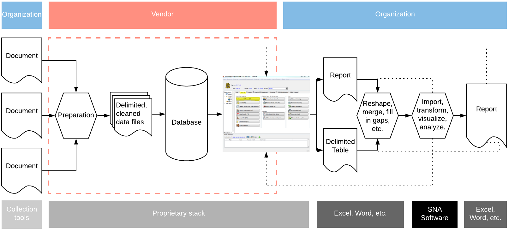
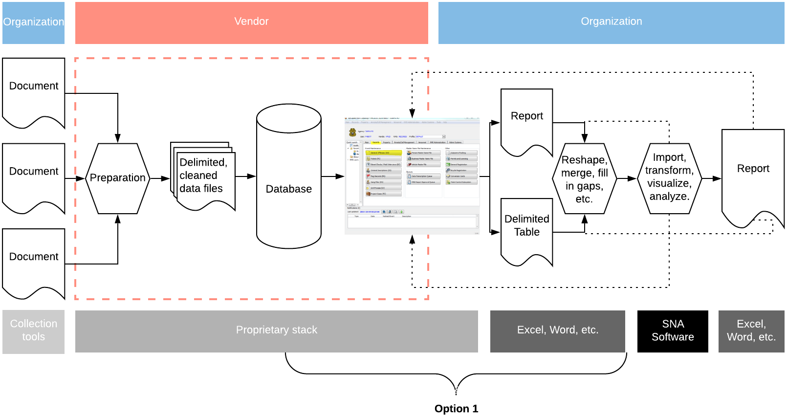
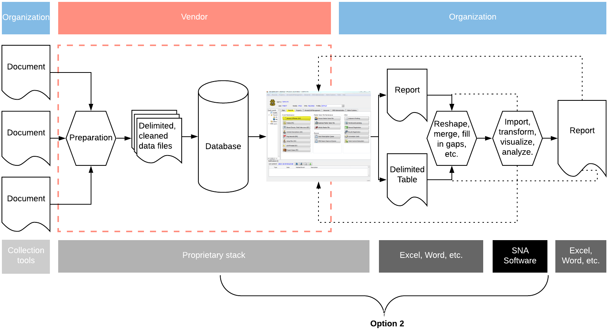
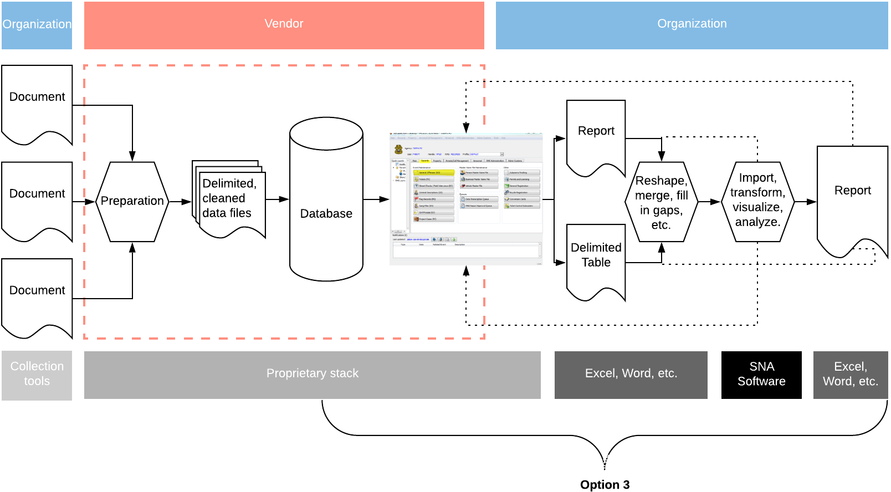

```{r setup, include=FALSE}
knitr::opts_chunk$set(echo      = TRUE,
                      warning   = FALSE,
                      message   = FALSE,
                      fig.align = "center",
                      comment   = '')

library(xaringanthemer)
style_mono_light(
  title_slide_background_color = "#23395b",
  code_font_family = "Fira Code",
  code_font_url    = "https://cdn.rawgit.com/tonsky/FiraCode/1.204/distr/fira_code.css",
  code_font_size   = ".65em",
  text_font_google = google_font("Work Sans", "300", "300i"),
  text_font_size   = "25px",
  background_size  = "20%", 
  background_posit = "bottom",
  padding          = "1em 4em 1em 4em",
  header_h1_font_size = "2.25rem",
  header_h2_font_size = "2.0rem",
  header_h3_font_size = "1.75rem"
)

here::set_here()

library(dplyr)
library(RSQLite)
con <- dbConnect(SQLite(), "my-db.sqlite")
```

# Motivation



__Goal:__ Present options for streamlining analysis.

---



__Option 1:__

  1. Engage with SQL database to bypass GUI
  2. Processing queries based on geography and events
  3. Generate necessary data sets for working with SNA software 

---

# My Assumptions

  * Your organizations works with an RMS that is powered by an SQL database
  * You, or someone in your organization, are able to interface with your database (preferably in read-only mode)
  * You are somewhat familiar with SQL or are interested in learning
  * You know SNA and have experience putting together data sets for this type of analysis

---

# Meet our database

.pull-left[

]
.pull-right[
Sample portable database (SQLite) with three tables:
  
  * `criminal_events`
  * `person_info`
  * `person_x_events`
]

</hr>

__NOTE: The data presented hereafter is not real LE data, only dummy data meant to mimic the actual returns.__

</hr></br>

.r-collapse-code[
```{r, eval = FALSE}
library(dplyr)
library(RSQLite)

con <- dbConnect(SQLite(), "my-db.sqlite")
dbListTables(con)
```
]

---

# `person_info`

```{r, echo = FALSE}
tbl(con, "person_info") %>%
  collect() %>%
  DT::datatable(class = 'cell-border stripe',
                rownames = FALSE,
                options = list(dom = 't',
                               scrollY = 300,
                               # scrollX = "100%",
                               scrollX = TRUE,
                               scroller = TRUE))
```

.r-collapse-code[
```{r, eval = FALSE}
tbl(con, "person_info") %>%
  collect()
```
]

---

# `person_x_events`

```{r, echo = FALSE}
tbl(con, "person_x_events") %>%
  collect() %>%
  DT::datatable(class = 'cell-border stripe',
                rownames = FALSE,
                options = list(dom = 't',
                               scrollY = 300,
                               # scrollX = "100%",
                               scrollX = TRUE,
                               scroller = TRUE))
```

.r-collapse-code[
```{r, eval = FALSE}
tbl(con, "person_x_events") %>%
  collect()
```
]

---

# `criminal_events`

```{r, echo = FALSE}
tbl(con, "criminal_events") %>%
  collect() %>%
  DT::datatable(class = 'cell-border stripe',
                rownames = FALSE,
                options = list(dom = 't',
                               scrollY = 300,
                               # scrollX = "100%",
                               scrollX = TRUE,
                               scroller = TRUE))
```

.r-collapse-code[
```{r, eval = FALSE}
tbl(con, "criminal_events") %>%
  collect()
```
]


---

# Building Network Data

.pull-left[
### Requirements

  * Edges list
  * Nodes attributes

### The Challenge

  * Edges in `person_x_events` table
  * <font color="red"> Person </font> attributes in `person_info` table
  * <font color="blue"> Event </font> attributes in `criminal_events` table
]


.pull-right[
```{r, echo = FALSE}
library(igraph)
bip_g <- igraph::sample_bipartite(5, 10, p = 0.5)
igraph::plot.igraph(bip_g,
                    layout       = layout_as_bipartite,
                    vertex.color = if_else(V(bip_g)$type == FALSE,
                                           "red",
                                           "blue"),
                    vertex.label = NA
                    )
```
]

---

# Generating an Edge List

.pull-left[
```{sql, eval = FALSE}
SELECT *
FROM `person_x_events`
```
]

.pull-right[

* How can I refine my query?
* What should we return for SNA?

]

```{r, echo = FALSE}
tbl(con, "person_x_events") %>%
  collect() %>%
  DT::datatable(class = 'cell-border stripe',
                rownames = FALSE,
                options = list(dom = 't',
                               scrollY = 200,
                               # scrollX = "100%",
                               scrollX = TRUE,
                               scroller = TRUE))
```
 
.r-collapse-code[
```{r, eval = FALSE}
tbl(con, "person_x_events") %>%
  collect()
```
]

---

# Filtering Observations

```{sql, eval = FALSE}
SELECT *
FROM `person_x_events`
WHERE (`Beat` = 2232.0 AND `FBI.Code` = '15')
```

```{r, echo = FALSE}
tbl(con, "person_x_events") %>%
  filter(Beat == 2232 & FBI.Code == "15") %>%
  collect() %>%
  DT::datatable(class = 'cell-border stripe',
                rownames = FALSE,
                options = list(dom = 't',
                               scrollY = 200,
                               # scrollX = "100%",
                               scrollX = TRUE,
                               scroller = TRUE))
```

.r-collapse-code[
```{r, eval = FALSE}
tbl(con, "person_x_events") %>%
  filter(Beat == 2232 & FBI.Code == "15") %>%
  collect()
```
]

---

# Selecting Variables

```{sql, eval = FALSE}
SELECT `PID` AS `Source`, `eventId` AS `Target`, `UpdateDate`
FROM `person_x_events`
WHERE (`Beat` = 2232.0 AND `FBI.Code` = '15')
```

```{r, echo = FALSE}
tbl(con, "person_x_events") %>%
  filter(Beat == 2232 & FBI.Code == "15") %>%
  select(Source = PID, Target = eventId, UpdateDate) %>%
  collect() %>%
  DT::datatable(class = 'cell-border stripe',
                rownames = FALSE,
                options = list(dom = 't',
                               scrollY = 200,
                               # scrollX = "100%",
                               scrollX = TRUE,
                               scroller = TRUE))
```

.r-collapse-code[
```{r, eval = FALSE}
tbl(con, "person_x_events") %>%
  filter(Beat == 2232 & FBI.Code == "15") %>%
  select(Source = PID, Target = eventId, UpdateDate) %>%
  collect()
```
]

---

# Adding Variables

```{sql, eval = FALSE}
SELECT `PID` AS `Source`, `eventId` AS `Target`, 'Person' AS `Source_class`,
'Event' AS `Target_class`, `UpdateDate`
FROM `person_x_events`
WHERE (`Beat` = 2232.0 AND `FBI.Code` = '15')
```

```{r, echo = FALSE}
tbl(con, "person_x_events") %>%
  filter(Beat == 2232 & FBI.Code == "15") %>%
  mutate(Source_class = "Person", Target_class = "Event") %>%
  select(Source = PID, Target = eventId, Source_class, Target_class, UpdateDate) %>%
  collect() %>%
  DT::datatable(class = 'cell-border stripe',
                rownames = FALSE,
                options = list(dom = 't',
                               scrollY = 170,
                               # scrollX = "100%",
                               scrollX = TRUE,
                               scroller = TRUE))
```

.r-collapse-code[
```{r, eval = FALSE}
tbl(con, "person_x_events") %>%
  filter(Beat == 2232 & FBI.Code == "15") %>%
  mutate(Source_class = "Person", Target_class = "Event") %>%
  select(Source = PID, Target = eventId, Source_class, Target_class, UpdateDate) %>%
  collect()
```
]

---

# Two-Mode to One-Mode

```{r, echo = FALSE}
tbl(con, "person_x_events") %>%
  filter(Beat == 2232 & FBI.Code == "15") %>%
  select(eventId, PID, UpdateDate) %>%
  inner_join(., 
             select(., eventId, PID2 = PID)) %>%
  select(Source = PID, Target = PID2, everything()) %>%
  filter(Source != Target) %>%
  collect() %>%
  DT::datatable(class = 'cell-border stripe',
                rownames = FALSE,
                options = list(dom = 't',
                               scrollY = 200,
                               # scrollX = "100%",
                               scrollX = TRUE,
                               scroller = TRUE))
```

.sql-collapse-code[
```{sql, eval = FALSE}
SELECT *
FROM (SELECT `PID` AS `Source`, `PID2` AS `Target`, `eventId`, `UpdateDate`
FROM (SELECT `LHS`.`eventId` AS `eventId`, `LHS`.`PID` AS `PID`, `LHS`.`UpdateDate` AS `UpdateDate`, `RHS`.`PID2` AS `PID2`
FROM (SELECT `eventId`, `PID`, `UpdateDate` FROM `person_x_events`
WHERE (`Beat` = 2232.0 AND `FBI.Code` = '15')) AS `LHS`
INNER JOIN (SELECT `eventId`, `PID` AS `PID2` FROM `person_x_events`
WHERE (`Beat` = 2232.0 AND `FBI.Code` = '15')) AS `RHS`
ON (`LHS`.`eventId` = `RHS`.`eventId`)))
WHERE (`Source` != `Target`)
```
]

.r-collapse-code[
```{r, eval = FALSE}
tbl(con, "person_x_events") %>%
  filter(Beat == 2232 & FBI.Code == "15") %>%
  select(eventId, PID, UpdateDate) %>%
  inner_join(., 
             select(., eventId, PID2 = PID)) %>%
  select(Source = PID, Target = PID2, everything()) %>%
  filter(Source != Target)
```
]

---

# Generating an Node List

```{sql, eval = FALSE}
SELECT *
FROM person_info
WHERE PID IN (SELECT `PID`
              FROM person_x_events
              WHERE (`Beat` = 2232.0 AND `FBI.Code` = '15'))
```

```{r, echo = FALSE}
tbl(con, sql(
  "
  SELECT *
  FROM person_info
  WHERE PID IN (SELECT `PID`
                FROM person_x_events
                WHERE (`Beat` = 2232.0 AND `FBI.Code` = '15'))
  ")) %>%
  collect() %>%
  DT::datatable(class = 'cell-border stripe',
                rownames = FALSE,
                options = list(dom = 't',
                               scrollY = 110,
                               # scrollX = "100%",
                               scrollX = TRUE,
                               scroller = TRUE))
```

.r-collapse-code[
```{r, eval = FALSE}
wants <- tbl(con, "person_x_events") %>%
  filter(Beat == 2232 & FBI.Code == "15") %>%
  select(PID) %>%
  collect() %>%
  unlist()
tbl(con, "person_info") %>%
  filter(PID %in% wants) %>%
  collect()
```
]

---

# Test, test, test

</br>

```{r, echo = FALSE, fig.align = 'center'}
knitr::include_graphics(path = "imgs/gephi.png")
```


.r-collapse-code[
```{r, eval = FALSE}
# Edges 
tbl(con, "person_x_events") %>%
  inner_join(., select(., eventId, PID2 = PID), by = "eventId") %>%
  filter(Source != Target & Beat == 2232 & FBI.Code == "15") %>%
  select(Source = PID, Target = PID2, eventId, UpdateDate) %>%
  write.csv(row.names = FALSE, file = "edges.csv")
# Nodes
tbl(con, sql("SELECT `PID` AS `Id`, `Name_Prefix`, `Name_Given`, `Name_Middle`, `Name_Sur`, `Name_Suffix`, `Sex`, `Race`, `Height`, `Weight`, `HairColor`, `EyeColor`, `DOB`, `Birth_Country`, `Address_StreetNumber`, `Address_StreetName`, `Address_StreetSuffix`, `Address_StreetUnit`, `Probation`, `Custody`, `Gang`, `Parole`, `Dead`, `Caution`
              FROM person_info
              WHERE PID IN (SELECT `PID` FROM person_x_events
                            WHERE (`Beat` = 2232.0 AND `FBI.Code` = '15'))")) %>%
  write.csv(row.names = FALSE, file = "nodes.csv")
```
]

---



__Option 2:__

  1. Expand on Option 1
  2. Introduce SNA via programming
  3. Generate node based queries
  
---

# SQL v. R

__Task: __ Query individuals with `PID` = 87 & 225

.pull-left[
```{sql, eval = FALSE}
SELECT *
FROM `person_x_events`
WHERE (`PID` IN (87.0, 225.0))
```
]

.pull-right[
```{r, eval = FALSE}
library(dplyr)
library(RSQLite)
con <- dbConnect(SQLite(),
                 "my-db.sqlite")
tbl(con, 'person_x_events') %>%
  filter(PID %in% c(87, 225)) %>%
  collect()
```
]

```{r, echo = FALSE}
tbl(con, 'person_x_events') %>%
  filter(PID %in% c(87, 225)) %>%
  collect() %>%
  DT::datatable(class = 'cell-border stripe',
                rownames = FALSE,
                options = list(dom = 't',
                               scrollY = 170,
                               # scrollX = "100%",
                               scrollX = TRUE,
                               scroller = TRUE))
```

---

# SQL v. R
.pull-left[
* Generate edges:
```{sql, eval = FALSE}
SELECT *
FROM `person_x_events`
WHERE (`PID` IN (87.0, 225.0))
```

* Graph edges
  
  1. Export Data
  2. Import Data
  3. `r emo::ji('doubt')`
]

.pull-right[
* Generate and graph: 
```{r, eval = TRUE, fig.height = 5}
# Prior connection and libraries
library(igraph)
tbl(con, 'person_x_events') %>%
  filter(PID %in% c(87, 225)) %>%
  graph_from_data_frame() %>%
  plot()
```
]

---

# Ego Network Data in R

__Task 1:__ Query individual `PID` = 225 and all attached events

.pull-left[
```{r, eval = FALSE}
# Events of interest
events <- tbl(con,
              'person_x_events') %>%
  filter(PID == 225) %>%
  select(eventId) %>%
  collect() %>%
  unlist()

# Collect the table
tbl(con, 'person_x_events') %>%
  filter(eventId %in% events) %>%
  collect()
```
]

.pull-right[
```{r, echo = FALSE}
events <- tbl(con, 'person_x_events') %>%
  filter(PID == 225) %>%
  select(eventId) %>%
  collect() %>%
  unlist()

tbl(con, 'person_x_events') %>%
  filter(eventId %in% events) %>%
  collect() %>%
  DT::datatable(class = 'cell-border stripe',
                rownames = FALSE,
                options = list(dom = 't',
                               scrollY = 300,
                               # scrollX = "100%",
                               scrollX = TRUE,
                               scroller = TRUE))
```
]

---

# Ego Network Data in R

__Task 2: __ Graph the data

.pull-left[
```{r, eval = FALSE}
# Using prior `events` to filter
# Get the data as a graph
g <- tbl(con,
         'person_x_events') %>%
  filter(eventId %in% events) %>%
  collect() %>%
  graph_from_data_frame()

# Plot the graph
g %>%
  plot()
```
]

.pull-right[
```{r, echo = FALSE}
g <- tbl(con,
         'person_x_events') %>%
  filter(eventId %in% events) %>%
  collect() %>%
  graph_from_data_frame() 

g %>%
  plot()
```
]

---

# Ego Network Data in R

__Task 3: __ Edit the graph to denote two-mode

.pull-left[
```{r, eval = FALSE}
g <- tbl(con,
         'person_x_events') %>%
  filter(eventId %in% events) %>%
  graph_from_data_frame() %>%
  set.vertex.attribute(
    name  = "type",
    value = stringr::str_detect(
      V(.)$name,
      "^E"))

g %>%
  plot(
    vertex.color = ifelse(
       V(g)$type == TRUE, 
       "red", "blue"),
     vertex.size  = ifelse(
       V(g)$type == TRUE,
       20, 10),
     vertex.shape = ifelse(
       V(g)$type == TRUE,
       "square", "circle")
     )
```
]

.pull-right[
```{r, echo = FALSE}
g <- tbl(con, 'person_x_events') %>%
  filter(eventId %in% events) %>%
  graph_from_data_frame() %>%
  set.vertex.attribute(
    name  = "type",
    value = stringr::str_detect(
      V(.)$name,
      "^E")
    )

plot(g,
     # === vertex
     vertex.color = ifelse(
       V(g)$type == TRUE, 
       "red", "blue"),
     vertex.size  = ifelse(
       V(g)$type == TRUE,
       20, 10),
     vertex.shape = ifelse(
       V(g)$type == TRUE,
       "square", "circle")
     )

```
]

---

# Ego Network Data in R

__Task 4: __ Project the network

.pull-left[
```{r, eval = FALSE}
g <- tbl(con, 'person_x_events') %>%
  filter(eventId %in% events) %>%
  graph_from_data_frame() %>%
  set.vertex.attribute(
    name  = "type",
    value = stringr::str_detect(
      V(.)$name,
      "^E")) %>%
  bipartite.projection(
    which = "false"
    )

plot(g)
```

]
.pull-right[
```{r, echo = FALSE}
g <- tbl(con, 'person_x_events') %>%
  filter(eventId %in% events) %>%
  graph_from_data_frame() %>%
  set.vertex.attribute(
    name  = "type",
    value = stringr::str_detect(
      V(.)$name,
      "^E")) %>%
  bipartite.projection(
    which = "false"
    )

plot(g)
```
]

---

# Ego Network Data in R

__Task 5: __ Run node metrics

.pull-left[
```{r, eval = FALSE}
g <- tbl(con, 'person_x_events') %>%
  filter(eventId %in% events) %>%
  graph_from_data_frame() %>%
  set.vertex.attribute(
    name  = "type",
    value = stringr::str_detect(
      V(.)$name,
      "^E")) %>%
  bipartite.projection(
    which = "false"
    ) %>%
  set.vertex.attribute(
    name  = "betweenness",
    value = betweenness(.)
  )

plot(g,
     vertex.size = get.vertex.attribute(g,
                                        "betweenness") * 5)
```

]
.pull-right[
```{r, echo = FALSE}
g <- tbl(con,
         'person_x_events') %>%
  filter(eventId %in% events) %>%
  graph_from_data_frame() %>%
  set.vertex.attribute(
    name  = "type",
    value = stringr::str_detect(
      V(.)$name,
      "^E")) %>%
  bipartite.projection(
    which = "false"
    ) %>%
  set.vertex.attribute(
    name  = "betweenness",
    value = betweenness(.,
                        directed = FALSE)
  )

plot(g,
     vertex.size  = get.vertex.attribute(g,
                                         "betweenness"))
```
]

---

# Streamlining Analyis in R

Sample network-level metrics:

Metric  | Explanation | Command
--------|-------------|---------
Density  | Number of observed ties divided by possible number of ties  | `edge_density()`
Average Degree  | Sum of ties divided by number of actors | `mean(degree())`
Global Clustering  | Sum of each actor's clustering divided by number of actors  | `transitivity()`

---

# Streamlining Network Analysis

Sample vertex-level metrics:

Metric  | Explanation | Command
--------|-------------|---------
Degree  | Count of actor's ties  | `degree()`
Eigenvector  | Weights an actor's centrality by the centrality of its neighbors  | `evcent()`
Closeness  | Average geodesic distance from an actor to another  | `closeness()`
Betweenness  | How often each actor lies on the shortest path between all other actors  | `betweenness()`


---



__Option 3:__

  1. Expand on Options 1 and 2
  2. Demo simple reporting tool

---

</br>
</br>
</br>
</br>
</br>
<center>
<a href = "https://callaghancorelab.shinyapps.io/simple_app/">
Time for an exciting demo!
</a>
</br>
`r emo::ji('party')` `r emo::ji('party')` `r emo::ji('party')` 

</center>


---

<br>
.center[
### Questions?
]

<center>
</img>
</center>

Christopher Callaghan - cjcallag@nps.edu
